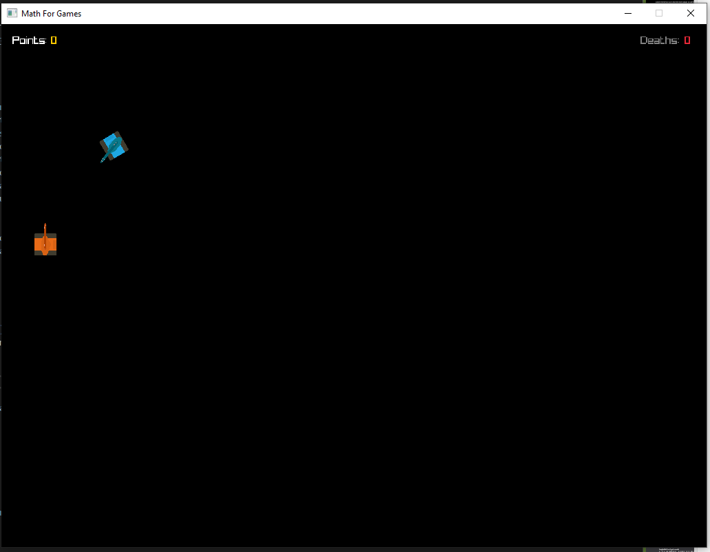
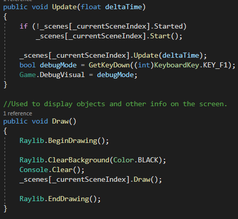
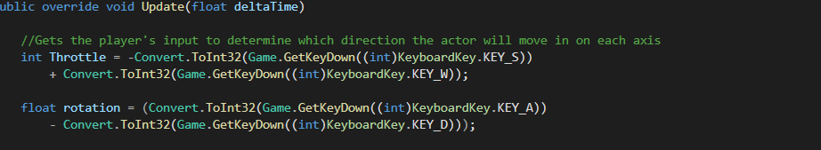

| Josiah Hartley|
| :---          	|
| s208046     	|
| Maths For Games |
| MathForGames Documentation |

## I. Requirements

1. Description of Problem

	- **Name**: Graphical Game Project

	- **Problem Statement**: 
Create a ‘technology demonstration’ that highlights the usefulness of your maths
classes by performing transformations within a graphical Test Application. The graphical test application should be a small demonstration only, not a complete game, though you
may create a game if you choose.

	- **Problem Specifications**:  
    An interactive 2D GUI that the user can use to interact with the 2D world in some manner, such as move their tank, rotate their gun, or fire a round from the players gun
    that collides and interacts with the enemy Tank.
    2D models animated using sprites and matrix3 variables, that react to user input to change active transforms using a math library. For example, a tank barrel ontop of the tank can only be rotated, yet stays ontop of the Tank.
    

2. Input Information
- Keyboard Key W - Increases Throttle For Players Tank
- Keyboard Key A - Creates Counter ClockWise Rotation For Players Tank
- Keyboard Key S - Decrease Throttle For Players Tank
- Keyboard Key D - Creates ClockWise Rotation For Players Tank
- Keyboard Key Q - Creates Counter ClockWise Rotation For Players Tanks Turret
- Keyboard Key E - Creates ClockWise Rotation For Players Tanks Turret
- Keyboard Key SPACE - "Launches" The Players Tanks Turrets Bullet
- Keyboard Key F1 - Hold to view extra visuals used for DeBug purposes

1.  Output Information
- The area both players can walk on is indicated by the Border of the Raylib Window
- The player current score, along with their deaths are displayed
   
1. User Interface Information

     **Game Graphical Output**: 

     
   The Game hud displays the players current score, and current deaths. As the player defeats the enemy, Score at the top of the hud increases. The HUD also increases deaths based on the collision of the Enemy's Bullet and the Players Tank..

  

## II. Design

 _System Architecture_

Main Game Flow

Because this applications purpose is to demonstrate the use of transforms and matricies, it realies heavily on eache scene and player doing what they need. Onc the program is started, players are thrown right into battle. The program only closes when the Exit button at the top right of the window is pressed.

Movement

To move, the player increases/decreases the throttle in the direction of the tank facing, the player can rotate the tank, but the rotation of the barell influences nothing about movement.

### Object Information

   **File**: Game.cs

     
  **Attributes**

         Name: _gameOver
             Description: Bool for whether or not the game should end
             Type: static bool

        Name: SetGameOver(bool value)
             Description: Sets _gameOver to the value_
             Type: static void

        Name: _debugVisual
             Description: Bool for whether or not to show the base Draw function of actor
             Type: static bool

        Name: DebugVisual
             Description: Getter and Setter for DebugVisual
             Type: static bool
        Name: GetKeyDown(int key)
             Description: returns true only if the int key is currently down
             Type: static bool
        Name: GetKeyPressed(int key)
             Description: returns true only if the int key has been pressed and is waiting in que
             Type: static bool
        Name: _scenes
             Description: Private array used to create scenes from the Game
             Type: Scene.cs[] 
        Name: _currentSceneIndex
             Description: Holds value for what position in the scene array is currently active
             Type: private int
       Name: CurrentSceneIndex
             Description: Getter function for _currentSceneIndex_
             Type: int
       Name: GetScene(int index)
             Description: Returns scene at the value of _scenes[index]
             Type: Scene
       Name: GetCurrentScene
             Description: Returns scene at the value of _scenes[CurentSceneIndex]
             Type: Scene   
       Name: AddScene(Scene scene)
             Description: Creates a new scene at the end of the array _scenes[]
             Type: int 
       Name: RemoveScene(Scene scene)
             Description: Removes a specific scene from the array _scenes[]
             Type: bool 
       Name: SetCurrentScene(int index)
             Description: Changes scenes to specifically this index
             Type: void
       Name: Game
             Description: Creates a new instance of Game with a new _scene array
             Type: Game.cs  
       Name: Start
             Description: Initializes Raylib Window and Scene1
             Type: void
       Name: Update (float deltaTime)
             Description: Calls for current scene to start if not already, then call the update function for the current scene
             Type: void
       Name: Draw
             Description: Calls for the current scenes draw function to be ran
             Type: void
       Name: End
             Description: Tests to see if the current scene has been and is currently started, if it is, runs the current scenes end function
             Type: void
       Name: Run
             Description: Main Game Loop, calls games start function then loops the update function then draw function as
             Type: void     

**File** : BulletBehaviour.cs

**Attributes**

         Name: Owner
             Description: The player that shot this bullet
             Type: string

        Name: DamageVal
             Description: Holds the number that decrements the enemies health.
             Type: int

        Name: TempObject
             Description: Temporary gameobject used to delete the bullet without deleting the prefab
             Type: GameObject
        Name: _laser
             Description: The laser model attached to this bullet
              Type: GameObject
       Name: ps
             Description: the particle system to be played when a bullet hits an obstacle
              Type: ParticleSystem   
        Name: playDeathParticleSystems(float duration)
             Description: plays the particle system after a bullet hits an object
              Type: void  
**File**: GridBehaviour.cs

**Attributes**

         Name: p1Panels
             Description: The reference to player 1's panels
             Type: PanelList
          Name: p2Panels
             Description: The reference to player 2's panels
             Type: PanelList
       Name: p1Position
             Description: player 1's current position on the grid
              Type:Vector2Variable 
       Name: p2Position
             Description: player 2's current position on the grid
              Type:Vector2Variable 
        Name: p1Materials
             Description: player 1's current amount of materials
              Type:IntVariable 
       Name: p2Materials
             Description: player 2's current amount of materials
              Type:IntVariable 
       Name: p1Direction
             Description: the direction player 1 is facing
              Type: Vector2Variable  
       Name: p2Direction
             Description: the direction player 2 is facing
              Type: Vector2Variable 
      Name: p1Material
             Description: the material for player 1's panels
              Type:Material 
       Name: p2Material
             Description: the material for player 2's panels
              Type:Material 
       Name: P1AssignLists
             Description: Sets player1 panels to the appropriate material and sets their owner to be player 1
              Type:void
       Name: P2AssignLists
             Description: Sets player2 panels to the appropriate material and sets their owner to be player 2
              Type:void
       Name: surrenderRowP1
             Description: Removes an entire row from player1 and gives it to player2
              Type:void
          Name: surrenderRowP2
             Description: Removes an entire row from player2 and gives it to player1
              Type:void
          Name: AssignPanelMaterials
             Description: Sets both players materials to either their red or blue variants
              Type:void
          Name: StealPanelP1
             Description: Takes one panel from player two and gives it player one
              Type:void
          Name: StealPanelP2
             Description: Takes one panel from player 1 and gives it player 2
              Type:void
          Name: FindNeighborsP1
             Description: finds and highlights all nearby panels in player 2's list for player1
              Type:void
          Name: FindNeighborsP2
             Description: finds and highlights all nearby panels in player 1's list for player2
              Type:void
          Name: UnHighlightPanelsP1
             Description: unhighlights all previously highlighted panels for player1
              Type:void
          Name: UnHighlightPanelsP2
             Description: unhighlights all previously highlighted panels for player2
              Type:void
**File**: GunBehaviour.cs

**Attributes**

         Name: Bullet
             Description: the bullet the gun will be firing
             Type: GameObject

        Name: Owner
             Description:the player that owns this gun
             Type: string
          Name: _tempBullet
             Description:temporary gameobject used to modify the bullets transform
             Type: GameObject
          Name: bulletForceScale
             Description:the amount the bullet force is scale up by
             Type: int
          Name:  _bulletForce
             Description:the total amount of force used to move the bullet
             Type: Vector3
          Name:  bulletDelay
             Description:the amount of time between firing bullets
             Type: int
          Name:  bulletCount
             Description:the amount of bullet to fire
             Type: int
          Name:  outOfAmmo
             Description:unity event raised when the gun is out of ammo
             Type: UnityEvent
          Name:  _tempTransform
             Description:temporary transform for the bullet
             Type: Transform
          Name:  _tempRigidBody
             Description:temporary rigidbody for the bullet
             Type: Rigidbody
          Name: damageVal
             Description:the amount of damge the bullet should deal
             Type: int
          Name: Fire
             Description:fires a bullet with a specified interval of time
             Type: IEnumerator
**File**: HealthBehaviour.cs

**Attributes**

         Name:Health_Ref
             Description: the reference of what the objects health should start as
             Type: IntVariable
          Name:Health
             Description: the current health of the object
             Type: IntVariable
          Name:IsAlive
             Description: whether or not the object is alive
             Type: bool
           Name:OnDeath
             Description: unity event raised when the object dies
             Type: UnityEvent
          Name:ps
             Description: the particles that should play on the objects death
             Type: ParticleSystem 
        Name: takeDamage(int damageVal)
             Description: decrements the objects health by the damge amount given
             Type: void
          Name: DestroyBlock(float time)
             Description: destroys the block within a given time given
             Type: void
          Name:playDeathParticleSystems(float duration)
             Description: plays particles after the object has died 
             Type: void
**File**: PanelBehaviour.cs

**Attributes**

         Name: Position
             Description: The position of the panel on the grid
             Type: Vector2

        Name: Owner
             Description: Is true if the panel has been selected or highlighted by the player
             Type: string

        Name: Occupied
             Description: Is true if a gameobjects position has been set to be the same as the panels
             Type: bool

        Name: DefaultColor
             Description: the color the panel is set to by default in the editor
             Type: Color
        Name: CurrentColor
            Description: the current color the panel is being set to
            Type: Color
        Name: SelectionColor
            Description: the color the panel should be highlighted when selected
            Type: Color
        Name: _selected
            Description: whether or not the panel is currently being selected
            Type: bool
        Name: _player1Mat
            Description: the reference tho the players material
            Type:Material
        Name: _player2Mat
            Description: the reference tho the players material
            Type:Material
        Name: _panelMat
            Description: the current material on the panel
            Type: Material
        Name: Init(Material player1Mat, Material player2Mat)
            Description: initializes the panel with the players materials and colors itself accordingly
            Type: void
          Name:HighlightPanel(bool isSelected)
            Description: Highlights the panel if the value passed in is true
            Type: void
          Name:UpdateColor
            Description: Updates the color of the panel to be that of its current owner
            Type: void
          Name:UpdateOwner(string newOwner)
            Description: changes the current owner of the panel to be the name of the item passsed in
            Type: void

   **File**: Accuracy.h

     Description: Stores two values used to determine whether a characters attack actually works. 

    **Attributes**

        Name: min
             Description: Holds the minimum value that the player can have in order to land a hit.
             Type: int
        Name: max
             Description: Holds the maximum value that the player can have in order to land a hit.
             Type: int
**File**: PanelList.cs

**Attributes**

        Name: OnPanelAssignmentFailed
             Description: raised when the a panel is somehow null
             Type: Event
        Name: panels
             Description: the list of panels tthis object holds
             Type: float
        Name: tempPanels
             Description: initializes this panel list to have a populated list and an owner
             Type: List<GameObject>
        Name:  Init(List<GameObject> startPanels, string playername)
             Description: initializes this panel list to have a populated list and an owner
             Type: void
        Name: CreateInstance(List<GameObject> startpanels, string playername)
             Description:creates an instance of this scriptable object
             Type: PanelList
        Name: Add(GameObject panel)
             Description: Adds a panel to the list
             Type: void
        Name: updateOwners
             Description: changes the owner of each panel in the list
             Type:  void
        Name: RemovePanel(GameObject panel)
             Description:  removes the desired panel from the list of panels
             Type: bool
        Name: TransferPanel(PanelList opponent_Panel_List, int panel_Index)
             Description: Transfers a single panel from one player list of panels to another
             Type: void
          Name:  SurrenderRow(PanelList opponent_Panel_List)
             Description: Transfers the last row of panels from one player to another
             Type: void
          Name:  FindIndex(Vector2 position, out int index)
             Description: returns the index of a panel at the given coordinates
             Type: bool
**File**: PauseMenuBehaviour.cs 

**Attributes**

        Name: OnPause
             Description: raised when the game is paused
             Type: Event 
        Name:  OnUnPause
             Description: raised when the game is unpaused
             Type:  Event
        Name: isPaused
             Description: true if the game is paused
             Type: bool
      
**File**: PlayerSpawnBehaviour.cs

**Attributes**

        Name: blockRef
             Description: The block the player is going to place
             Type:  BlockVariable
        Name: blocks
             Description: the blocks the player has to choose from
             Type: List<GameObject>
        Name: direction
             Description: The direction the player is inputting. Used to determine where the object will spawn
             Type: Vector2Variable 
        Name: player
             Description: used to get access to the list of available panels
             Type: PlayerMovementBehaviour 
        Name: panels_in_range
             Description: Used to store all panels that the player can spawn the object on
             Type: Dictionary<string, GameObject> 
        Name: block_rotation
             Description: Used to store the blocks current rotation
             Type: Quaternion
        Name: rotation_val
             Description: The angle at which the block is being rotated
             Type: float
        Name: materials
             Description: The amount of materials a player has at any given time
             Type: IntVariable 
        Name: material_regen_rate
             Description:How quickly the player can gain more materials
             Type: float
        Name: material_regen_time
             Description: The amount of time the has past since the last material regen
             Type: float
        Name:  CheckMaterial(int costOfItem)
             Description: Checks the amount of materials the player has  before allowing them to purchase something
             Type: void
        Name: GetCurrentBlock()
             Description: Returns the color of the current block  the player has selected to update the temp ui
             Type: void
        Name:AddMaterials(int Amount)
             Description: Adds materials to the players material pool
             Type: void
        Name: FindNeighbors()
             Description: Finds and highlights all neighboring panels in cardinal directions 
             Type: void
        Name: UnHighlightPanels()
             Description: Unhighlights all selected panels.
             Type: void
        Name: NextBlock
             Description: Sets the current block to the next block in the list
             Type: void
        Name: PreviousBlock
             Description:Sets the current block to the next block in the list
             Type: void
          Name: PlaceBlockLeft
             Description:Places the current block to the left of the player
             Type: void
          Name: PlaceBlockRight
             Description:Places the current block to the right of the player
             Type: void
          Name: PlaceBlockUp
             Description:Places the current block above the player
             Type: void
          Name: PlaceBlockDown
             Description:Places the current block belowthe player
             Type: void
          Name: RotateBlock
             Description:Rotates the block -90 degrees
             Type: void
**File**: RoutineBehaviour.cs

**Attributes**

        Name: onActionsBegin
             Description: Holds the list of actions that will be done by the gameobject
             Type: Event
        Name: onActionsCompleted
             Description:Holds the list of actions that will be done by the gameobject
             Type: int
        Name: actionDelay
             Description: Time it takes to invoke the actions event
             Type: float
    
       Name: actionLimit
             Description: Number of times the actions event will be invoked
             Type: int
       Name:  PerformActions
             Description: Tries to preform all actions in the list 
             Type: void
**File**: InputAxisBehaviour.cs

**Attributes**

        Name: HorizontalAxis
             Description: the horizontal axis that controls this player
             Type: string
        Name: VerticalAxis
             Description: the vertical axis that controls this player
             Type: string
          Name: Direction
             Description: the direction the player is holding
             Type:Vector2Variable
          Name: isRawInput
             Description: if true Input.GetAxisRaw is used instead of Input.GetAxis
             Type:bool
          Name: SendAnimationMessage
             Description: sends a message to the playeranimationbehaviour script tp disable or enable movement
             Type:void
          Name: InRange(float val,float num1, float num2)
             Description: Checks if a float is in the range of two other floats
             Type:void
          Name: InRange(float val,float num1, float num2)
             Description: checks if the player has been stationary for short period to enable the idle animation
             Type:bool
**File**: InputButtonBehavhiour.cs

**Attributes**

        Name: inputs
             Description: list of inputs the player has
             Type: List<InputVariable>
    
       Name:newInput
             Description: reference to the last input added
             Type:InputVariable
        Name:  CheckButton
             Description: checks the list to see if any of the button are down
             Type: void
        Name: AddInput(string Axis,string message1,string message2,string message3, object Arg)
             Description: adds an input to the list
             Type: void
        Name: Clear
             Description: clears the entire input list
             Type: void
        Name: operator ==
             Description: Returns true if an iterators current is not the same as the current in this instance.
             Type: const bool
**File**: PlayerMovementBehaviour.cs

**Attributes**

        Name:  Position
             Description: The players current position on the grid
             Type: Vector2
    
       Name: PositionRef
             Description: reference to the players position on the grid
             Type:ector2Variable 
        Name:  Destination
             Description: The players desired position on the grid
             Type: Vector2
        Name:  Direction
             Description: The direction in which the player is trying to travel on the grid
             Type: Vector2Variable
        Name: _currentPanel
             Description: the current panel the player is on
             Type:GameObject 
        Name: NewPanel
             Description:Used to store the value of the panel the player will be traveling to
             Type: GameObject
          Name: startingPanels
             Description:The list of all panels available to the player
             Type:List<GameObject>
          Name: EnablePanelSteal
             Description:Allows the player to steal panels
             Type:void
          Name: DisablePanelSteal
             Description:disables the ability to steal panels
             Type:void
          Name: StealPanel
             Description:Raises the event to steal a panel form the other panel
             Type:void
          Name: EnableMovement
             Description:enables the players movement
             Type:void
          Name: DisableMovement
             Description:disables the players movement
             Type:void
          Name: UpdatePosition
             Description:Sets the players position to the desired panel if it exists and is not occupied
             Type:void
          Name: CheckPanels(Vector2 PanelPosition, out GameObject ReturnPanel)
             Description:Checks to see if a panel is accessible
             Type:bool
          Name: ChangeDestination
             Description:Is used to update the destination vector to be the desired location of the player
             Type:bool