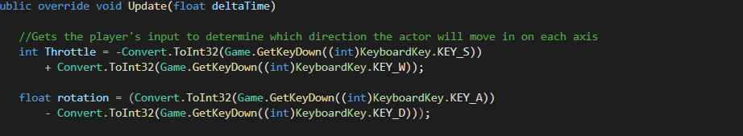

| Josiah Hartley|
| :---          	|
| s208046     	|
| Game Programming |
| Tank Game Documentation |

## I. Requirements

1. Description of Problem

	- **Name**: Tank Game

	- **Problem Statement**: 
Create a ‘technology demonstration’ that highlights the usefulness of your maths
classes by performing transformations within a graphical Test Application. The graphical test application should be a small demonstration only, not a complete game, though you
may create a game if you choose.

	- **Problem Specifications**:  
    An interactive 2D GUI that the user can use to interact with the 2D world in some manner, such as move their tank, rotate their gun, or fire a round from the players gun
    that collides and interacts with the enemy Tank.
    2D models animated using sprites and matrix3 variables, that react to user input to change active transforms using a math library. For example, a tank barrel ontop of the tank can only be rotated, yet stays ontop of the Tank.
    

2. Input Information
- Keyboard Key W - Increases Throttle For Players Tank
- Keyboard Key A - Creates Counter ClockWise Rotation For Players Tank
- Keyboard Key S - Decrease Throttle For Players Tank
- Keyboard Key D - Creates ClockWise Rotation For Players Tank
- Keyboard Key Q - Creates Counter ClockWise Rotation For Players Tanks Turret
- Keyboard Key E - Creates ClockWise Rotation For Players Tanks Turret
- Keyboard Key SPACE - "Launches" The Players Tanks Turrets Bullet
- Keyboard Key F1 - Hold to view extra visuals used for DeBug purposes

1.  Output Information
- The area both players can walk on is indicated by the Border of the Raylib Window
- The player current score, along with their deaths are displayed
   
1. User Interface Information

     **Game Graphical Output**: 

     
   The Game hud displays the players current score, and current deaths. As the player defeats the enemy, Score at the top of the hud increases. The HUD also increases deaths based on the collision of the Enemy's Bullet and the Players Tank..

  

## II. Design

 _System Architecture_

Main Game Flow

Because this applications purpose is to demonstrate the use of transforms and matricies, it realies heavily on eache scene and player doing what they need. Onc the program is started, players are thrown right into battle. The program only closes when the Exit button at the top right of the window is pressed.

Movement

To move, the player increases/decreases the throttle in the direction of the tank facing, the player can rotate the tank, but the rotation of the barell influences nothing about movement.

### Code Information
   **File**: Program.cs

     
  **Attributes**

         Name: Main()
             Description: Creates a new instance of Game, and calls its run function
             Type: static int

   **File**: Game.cs

     
  **Attributes**

         Name: _gameOver
             Description: Bool for whether or not the game should end
             Type: static bool

        Name: SetGameOver(bool value)
             Description: Sets _gameOver to the value_
             Type: static void

        Name: _debugVisual
             Description: Bool for whether or not to show the base Draw function of actor
             Type: static bool

        Name: DebugVisual
             Description: Getter and Setter for DebugVisual
             Type: static bool
        Name: GetKeyDown(int key)
             Description: returns true only if the int key is currently down
             Type: static bool
        Name: GetKeyPressed(int key)
             Description: returns true only if the int key has been pressed and is waiting in que
             Type: static bool
        Name: _scenes
             Description: Private array used to create scenes from the Game
             Type: Scene.cs[] 
        Name: _currentSceneIndex
             Description: Holds value for what position in the scene array is currently active
             Type: private int
       Name: CurrentSceneIndex
             Description: Getter function for _currentSceneIndex_
             Type: int
       Name: GetScene(int index)
             Description: Returns scene at the value of _scenes[index]
             Type: Scene
       Name: GetCurrentScene
             Description: Returns scene at the value of _scenes[CurentSceneIndex]
             Type: Scene   
       Name: AddScene(Scene scene)
             Description: Creates a new scene at the end of the array _scenes[]
             Type: int 
       Name: RemoveScene(Scene scene)
             Description: Removes a specific scene from the array _scenes[]
             Type: bool 
       Name: SetCurrentScene(int index)
             Description: Changes scenes to specifically this index
             Type: void
       Name: Game
             Description: Creates a new instance of Game with a new _scene array
             Type: Game.cs  
       Name: Start
             Description: Initializes Raylib Window and Scene1
             Type: void
       Name: Update (float deltaTime)
             Description: Calls for current scene to start if not already, then call the update function for the current scene
             Type: void
       Name: Draw
             Description: Calls for the current scenes draw function to be ran
             Type: void
       Name: End
             Description: Tests to see if the current scene has been and is currently started, if it is, runs the current scenes end function
             Type: void
       Name: Run
             Description: Main Game Loop, calls games start function then loops the update function then draw function as long as GameOver is true, once it is false, the game stops looping and calls the End Function
             Type: void     

**File** : Scene.cs

**Attributes**

         Name: _actors
             Description: Actor array used to store what actors are in this scene
             Type: Actor[]

        Name: _transform
             Description: Holds the transform of the current scene, all entities in this scene are affected by this
             Type:Matrix3

        Name: Started
             Description: Bool for whether this scene has been and is currently started
             Type: Bool
        Name: Scene()
             Description: Creates a new scene with an empty actor[]
              Type: Scene.cs
       Name: World
             Description: Getter for the _transform function
              Type: Matrix3   
        Name: _score
             Description: Holds the players score in the xVal, and the players death in the yVal
              Type: Vector2
        Name: Score
             Description: Getter for the _score Vector2_
              Type: Vector2
        Name: TestForCollision(Actor referenceEntity)
             Description: Tests for collision with all actors if referenceEntity can collide, if colliding, both referenceEntity and colliding Entity set to is colliding
              Type: void
        Name: TestForCollisionWith(Actor reference, Actor entity)
             Description: If both actors can collide, test to see if these two are colliding, if so, returns true
              Type: Bool
        Name: AddActor(Actor actor)
             Description: Adds a new instance of actor to the current _actors[] in this instance
              Type: void
        Name: RemoveActor(int index)
             Description: Removes the actor at this specific index in this scenes instance of _actors[]
              Type: bool
        Name: RemoveActor(Actor actor)
             Description: Removes this actor at any index in this scenes instance of _actors[]
              Type: bool
        Name: Start
             Description: Declares this instance of scene is started
              Type: virtual void
        Name: Update(float deltaTime)
             Description: Makes this instance of scene's actor[] call the update function of all actors in the []
              Type: virtual void
        Name: Draw
             Description: Makes this instance of scene's actor[] call the draw function of all actors in the []
              Type: virtual void
        Name: End
             Description: Makes this instance of scene's actor[] call the End function of all actors in the [] if the actors are started
              Type: virtual void
**File** : Sprite.cs

**Attributes**

         Name: _texture
             Description: Holds the sprite image
             Type: Texture2D

        Name: Width
             Description: Holds the value of the height of the texture
             Type:int
        Name: Height
             Description: Holds the value of the width of the texture
             Type: Bool
        Name: Sprite(Texture2D texture)
             Description: sets _texture = texture_
              Type: Sprite.cs
        Name: Sprite(string path)
             Description: sets _texture = the image at path
              Type: Sprite.cs
        Name: Draw(matrix3 transform)
             Description: draws the sprite with the values of transform
              Type: void.

**File**: Projectile.cs

**Attributes**

        Name: _existence
             Description: holds the total deltaTime that this projectile has been visible
              Type: float
        Name: _lifeSpan
             Description: holds the total deltaTime that this projectile should be visible
              Type: float
        Name: Existence
             Description: Getter and Setter for _existence
              Type: float
        Name: Projectile(float x, float y, Color rayColor, char icon = ' ', ConsoleColor color = ConsoleColor.White)
             Description: creates a new projectile at a position (x,y) and applies the cosmetic variabls
              Type: Projectile.cs
        Name: Projectile(Matrix3 localTransform, string path)
             Description: creates a new projectile at a position (localTransform.m13,localTransform.m23) and applies the sprite cosmetic
              Type: Projectile.cs
        Name: Start()
             Description: sets this projectile to be collidable, and invisible then runs the base start to set this instance to Started
              Type: void
        Name: Update(float deltaTime)
             Description: Tests for if the bullet is visible, if it is, adds to its lifetime and tests for collision
              Type: void
        Name: Draw
             Description: If the projectile should be visible, it is drawn at its global transform
              Type: void
        Name: End
             Description: Calls the end function for this Projectile
              Type: void
        Name: UpdateTransform
             Description: Sets the local transform values to the congegation of its translation, rotation, and scal
              Type: void
         
**File**: PlayersTurret.cs

**Attributes**

        Name: PlayersTurret(float x, float y, Color rayColor, char icon = ' ', ConsoleColor color = ConsoleColor.White)
             Description: Creates a new turret at (x,y) with the sprite of red tank barrell
              Type: PlayerTurret.cs
        Name: Update(deltaTime)
             Description: Responsible for accepting turrent input, KeyBoard Key - Q & E & Space
              Type: void
        Name: Draw
             Description: If the turret should be visible it prints the turret
              Type: void

**File**: Player

**Attributes**

        Name: _speed
             Description: keeps track of the speed of the player
              Type: float
        Name: Speed
             Description: Getter and Setter for _speed
              Type: float
        Name: Player(float x, float y, Color rayColor, char icon = ' ', ConsoleColor color = ConsoleColor.White)
             Description: Creates a new instance of Player with the above cosmetics
              Type: Player.cs
        Name: Update(float deltaTime)
             Description: Responsible for throttle and rotation of the players tank, and tests for collision
              Type: void
        Name: Draw
             Description: If is visible, draws sprite at global transform
              Type: void
**File**: EnemysTurret

**Attributes**
        Name: EnemysTurret(float x, float y, Color rayColor, char icon = ' ', ConsoleColor color = ConsoleColor.White)
             Description: Creates a new instance of Player with the above cosmetics
              Type: EnemysTurret.cs
        Name: Start
             Description: Declares this instance of EnemysTurret Started
              Type: void
        Name: Update(float deltaTime)
             Description: Responsible for Looking at player and launching projectiles at a certain range
              Type: void
        Name: Draw
             Description: If is visible, draws sprite at global transform
              Type: void
        Name: End
             Description: Declares this instance of EnemysTurret Not Started then calls base end
              Type: void

**File**: Enemy.cs

**Attributes**

        Name: Enemy(float x, float y, char icon = ' ', ConsoleColor color = ConsoleColor.White)
             Description: declares a new instance of enemy with the above cosmetics at (x,y)
             Type: Enemy.cs
        Name: Enemy(float x, float y, Color rayColor, char icon = ' ', ConsoleColor color = ConsoleColor.White)
             Description: declares a new instance of enemy with the above cosmetics at (x,y)
             Type: Enemy.cs
        Name: Update(float deltaTime)
             Description: Responsible for rotating tank to look at player, and increase throttle to approach player to a certain distance
             Type: override void
        Name: Draw
             Description: If this instance is visible, draws the sprite at global transform
             Type: void

**File**: Actor.cs

**Attributes**

        Name:  _sprite 
             Description: holds actors sprite information
             Type: Sprite.cs    
       Name: _icon
             Description: used for debug purposes, holds char for actor
             Type:char 
        Name:  _color
             Description: Color of the icon
             Type: ConsoleColor
        Name:  _rayColor
             Description: Color of raylib related code
             Type: Color
        Name: Started
             Description: Keeps track of whether this instance of actor has started
             Type:bool 
        Name: Actor(float x, float y, char icon = ' ', ConsoleColor color = ConsoleColor.White)
             Description: Creates an Actor at position (x,y) with above cosmetics
             Type: Actor.cs
        Name: Actor(float x, float y, Color rayColor, char icon = ' ', ConsoleColor color = ConsoleColor.White)
             Description: Creates an Actor at position (x,y) with above cosmetics 
             Type:Actor.cs
        Name: Actor(Matrix3 LocalTransform, string path)
             Description: Creates an Actor at position (x,y) with above cosmetics 
             Type:Actor.cs
        Name: _velocity
             Description: Hold x and y values of this instances velocity 
             Type: Vector2
        Name: _acceleration
             Description: Hold x and y values of this instances acceleration
             Type: Vector2
        Name: _maxSpeed
             Description: The most that the velocity magnitude can be equal to
             Type: float
        Name: Velocity
             Description: Getter and setter for _velocity_
             Type: Vector2
        Name: Acceleration
             Description: Getter and setter for _acceleration
             Type: Vector2
        Name: MaxSpeed
             Description: Getter and setter for max speed
             Type: float
        Name: Rotate(float angle)
             Description: sets the _rotation matrix3 to angle around the z axis
             Type: void
        Name: _globalTransform
             Description: holds the matrix3 information for the transformation of this actor in a global transform
             Type: Matrix3
        Name: _localTransform
             Description: holds the matrix3 information for the transformation of this actor in a local transform
             Type: Matrix3
        Name: _translation
             Description: holds the matrix3 information for the position of this actor in a local transform
             Type: Matrix3
        Name: _rotation
             Description: holds the matrix3 information for the rotation of this actor in a local transform
             Type: Matrix3
        Name: _scale
             Description: holds the matrix3 information for the scale of this actor in a local transform
             Type: Matrix3
        Name: _currentRadianRotation
             Description: holds the current rotation value around the z axis
             Type: float
        Name: _rotationSpeed
             Description: Holds the current speed at which the actor should rotate default 0
             Type: float
        Name: _collisionRadius
             Description: Holds the value of the radius of which this actor is deemed to take up physically
             Type: float
        Name: WorldPosition
             Description: Getter for the global position of this instance of actor
             Type: Vector2
        Name: GlobalTransform
             Description: Getter for _globalTransform_
             Type: Vector2
        Name: LocalPosition
             Description: Getter for _localTranslation_
             Type: float
        Name: SetTranslation(Vector2 position)
             Description: sets _localTranslate to position_
             Type: void
        Name: SetRotation(float radians)
             Description: sets _rotation to radians and _currentradianrotation to radians_
             Type: void
        Name: SetRotationSpeed(float speed)
             Description: Sets how far the entity should rotate per frame
             Type: void
        Name: SetScale(float x, float y)
             Description: Sets _scale equal to (x,y)
             Type: void
        Name: _isVisible
             Description: holds the value for whether this actor is visible
             Type: bool
        Name: IsVisible
             Description: Getter and setter for _isVisible
             Type: bool
        Name: _isColliding
             Description: holds the value for whethere this actor is colliding
             Type: bool
        Name: _collidable
             Description: Holds the value for whether this actor is able to collide
             Type: bool
        Name: Collidable
             Description: Getter and setter for _collidable
             Type: bool
        Name: CollisionRadius
             Description: Getter and setter for Collision Radius
             Type: float
        Name: isColliding
             Description: Getter and setter for _isColliding
             Type: bool
        Name: _parent
             Description: This instances actor's local transform is concatenated with the _parent global transform to give this instance actor a _global transform_
             Type: Actor.cs
        Name: Parent
             Description: Getter for _parent_
             Type: Actor.cs
        Name: _children
             Description: used to keep track of this actors list of actors concatenating with this actor
             Type: Actor[]
        Name: Children
             Description: Getter for _children_
             Type: Actor[]
        Name: _isChild
             Description: Keeps track as to whethere this actor has a parent
             Type: bool
        Name: IsChild
             Description: Getter for _isChild_
             Type: bool
        Name: AddChild(Actor child)
             Description: adds child to this actors _children[]
             Type: void
        Name: RemoveChild(Actor child)
             Description: removes child from this actors _children[]
             Type: bool
        Name: _Tank
             Description: Used to create a reference between projectiles and the turret
             Type: Actor.cs
        Name: Tank
             Description: Getter for _tank
             Type: Actor.cs
        Name: _projectiles
             Description: Used to create a reference between projectiles and the turret
             Type: Projectile[]
        Name: Projectiles
             Description: Getter for _projectiles
             Type: Projectile[]
        Name: _isBullet
             Description: Keeps track as to whether this actor is a bullet
             Type: bool
        Name: AddAmmo(Projectile bullet)
             Description: Adds bullet to the _projectiles[]_
             Type: void
        Name: RemoveAmmo
             Description:  Removes bullet from the _projectiles[]_
             Type: bool
        Name: _target
             Description: creates a reference between this actor and target
             Type: Actor
        Name: Target
             Description: Getter for _target_
             Type: Actor.cs
        Name: AddTarget(Actor target)
             Description: Sets target to this actors _target_
             Type: void
        Name: RemoveTarget
             Description: Sets this actors _target = null_
             Type: bool
        Name: Forward
             Description: Returns this actors global xrotation values
             Type: Vector2
        Name: LookAt(Vector2 position)
             Description: Sets this actors xrotation values to face position
             Type: void
        Name: LookAt(Actor actor)
             Description: Sets this actors xrotation values to face actor
             Type: void
        Name: LookAt(Actor actor, dloat deltaTime)
             Description: Sets this actors xrotation values to face position at the rate of deltaTime
             Type: void
        Name: UpdateTransform
             Description: Concatenates _rotation, _translation, and _scale to replace _globalTransform
             Type: void
        Name: LaunchProjectiles(Projectile bullet)
             Description: Takes this actors projectile and sets its translation to the end of the barrel, and same rotation, sets bullets velocity equal to turrets forward
             Type: void
        Name: Start
             Description: Declares this actor is started
             Type: void
        Name: Update(float deltaTime)
             Description: Applies acceleration, friction, and applies invisible barriers around border windows
             Type: void
        Name: Draw
             Description: If debugVisuals is true, applies visual effects to see velocity, rotation, and collision radius of actors
             Type: void
        Name: End
             Description: If the actor is started, declares the actor is no longer started
             Type: void

